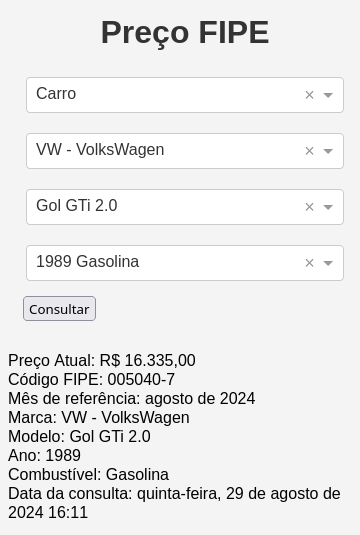

# preco-fipe
Preços médios de veículos diretamente da FIPE. 

`requests` `Dash` `Plotly`

## Run
```bash
docker run -dt --rm --entrypoint ./app/run.sh --name preco-fipe -v $(pwd):/app -p 8050:8050 python:3.11-alpine
```
🌐 http://localhost:8050

<div align="center">
  
  
</div>

## Licença
Esse projeto está sob a licença MIT.
