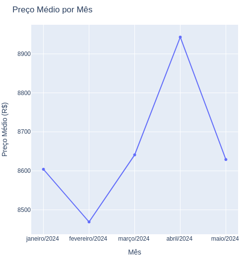

# preco_fipe
Preços médios de veículos diretamente da FIPE. 


```python
# Exemplo Honda Biz 125+ 2010
{
 'Valor': 'R$ 8.629,00',
 'Marca': 'HONDA',
 'Modelo': 'BIZ 125+',
 'AnoModelo': 2010,
 'Combustivel': 'Gasolina',
 'CodigoFipe': '811084-0',
 'MesReferencia': 'maio de 2024 ',
 'Autenticacao': 'ccy27vd0q9kq',
 'TipoVeiculo': 2,
 'SiglaCombustivel': 'G',
 'DataConsulta': 'quarta-feira, 29 de maio de 2024 09:57'
}
```

Preço médio da Honda Biz 125+ 2010 em 2024(Janeiro-Maio)



- codigoTipoVeiculo: 1(carro), 2(moto), 3(caminhão)
